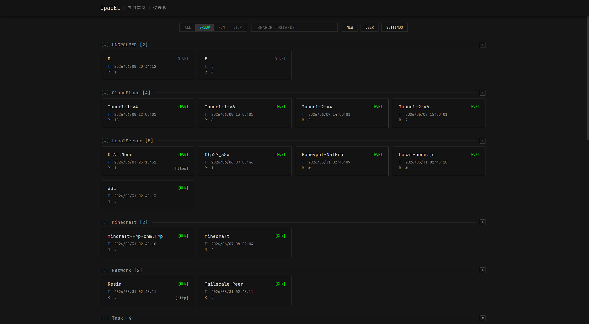
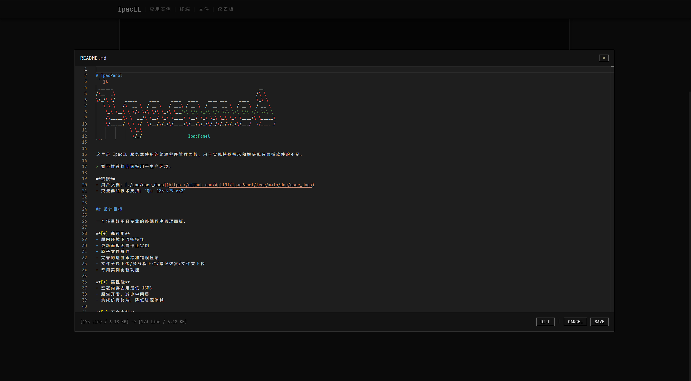
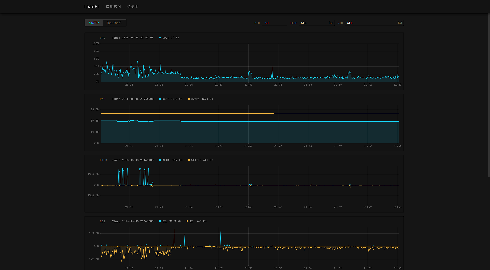

# IpacPanel
```js
 ______                                                            __     
/\__  _\                                                          /\ \    
\/_/\ \/    _____     ____     ____   ____    ____ ___     ____   \_\ \   
   \ \ \   /\  __ \  / __ \   / ___\ / __ \  /  __  __ \  / __ \  / __ \  
    \_\ \__\ \ \/\ \/\ \/\ \_/\ \__//\ \/\ \_/\ \/\ \/\ \/\ \/\ \/\ \/\ \ 
    /\_____\\ \  __/\ \__/ \_\ \____\ \__/ \_\ \_\ \_\ \_\ \____/\ \_____\
    \/_____/ \ \ \/  \/__/\/_/\/____/\/__/\/_/\/_/\/_/\/_/\/___/  \/____ /
              \ \_\                                                       
               \/_/                   IpacPanel                           
```

这里是 IpacEL 服务器使用的终端程序管理面板, 用于实现特殊需求和解决现有面板软件的不足.

> 暂不推荐将此面板用于生产环境.

**链接**
- 用户文档: [./doc/user_docs](https://github.com/ApliNi/IpacPanel/tree/main/doc/user_docs)
- 交流群和技术支持: `QQ: 185-979-632`


## 设计目标

一个轻量好用且专业的终端程序管理面板.

**[+] 高可用**
- 弱网环境下流畅操作
- 更新面板无需停止实例
- 原子文件操作
- 完善的进度跟踪和错误显示
- 文件分块上传/多线程上传/错误恢复/文件夹上传
- 专用实例更新功能

**[+] 高性能**
- 空载内存占用最低 15MB
- 原生开发, 减少中间层
- 集成仿真终端, 降低资源消耗

**[-] 不会支持**
- 容器: 您可以通过命令启动容器, 但面板本身不会添加与容器相关的功能
- 应用商店: 您需要自行管理应用程序的文件


## 特殊功能
- 实例更新
- 实例无终端运行
- 实例严格重启
- 实例清理命令
- 实例访问链接
- 文件夹上传
- 面板不停机更新
- 高级文本编辑器
- 仪表板


**截图**







## 计划中

- [ ] 用户文档
- [ ] 插件系统
- [ ] 数据库编辑器


## 项目结构

```
.
├── build.go                 # 构建和打包脚本
├── go.mod / go.sum
│
├── controller/              # 管理进程
│   ├── main.go              # 管理进程入口
│   ├── src/
│   │   ├── config/          # 配置
│   │   ├── process/         # 实例管理
│   │   ├── web/             # Web 服务
│   │   │   └── api/         # Web API / WebSocket
│   │   ├── compat/          # 跨平台兼容工具
│   │   ├── atomic/file/     # 原子文件写入工具
│   │   └── msg/             # 消息定义
│   │
│   └── public/              # Web 前端静态资源
│       ├── index.html       # 前端入口
│       ├── lib/             # 前端第三方库
│       └── src/
│           ├── api/         # 前端 API 封装
│           ├── page/        # 页面代码
│           ├── module/      # 模块化代码: 终端/文件管理/弹窗/用户管理等
│           ├── platform/    #
│           └── utils/       # 工具/图标/枚举
│
├── daemon/                  # 守护进程
│   ├── main.go              # 守护进程入口
│   ├── server.go            # 守护进程服务主流程
│   ├── controller.go        # 管理进程管理
│   ├── instance.go          # 实例生命周期管理
│   ├── protocol.go          # stdio 通讯协议
│   ├── terminal/            # PTY/ConPTY 终端封装
│   └── compat/              # 跨平台兼容工具
│
├── dev/                     # 开发和测试工具
├── tester/                  # 自动化测试程序
└── doc/                     # 部分设计文档
    └── user_docs/           # 用户文档
```

由于项目初期有大量设计描述没有形成文档, 因此当前设计文档并不完善.


## 构建

```bash
git clone https://github.com/ApliNi/IpacPanel.git
cd IpacPanel
go run ./build.go
```

构建产物存放在 `./build` 目录.

其他构建参数请查看 `./build.go` 文件.


## 直接依赖

**前端**
- 原生前端
- 网页终端: [xterm.js](https://github.com/xtermjs/xterm.js)
- 文本编辑器: [Monaco-Editor](https://github.com/microsoft/monaco-editor)
- 图表库: [uPlot](https://github.com/leeoniya/uPlot)
- 中文等宽字体: [JetBrainsMapleMono-Medium](https://github.com/SpaceTimee/Fusion-JetBrainsMapleMono), [字体分包](https://chinese-font.netlify.app/zh-cn/online-split/)
- 英文等宽字体: [JetBrainsMono-Regular](https://github.com/JetBrains/JetBrainsMono)
- 矢量图标: [Lucide](https://lucide.dev/icons/)
- 图像/图标: [IpacEL](https://ipacel.cc)

**管理进程**
- Golang, 及其标准库
- WebSocket: [`github.com/gorilla/websocket`](https://github.com/gorilla/websocket)
- 定时任务调度: [`github.com/reugn/go-quartz/quartz`](https://github.com/reugn/go-quartz)
- 系统指标采集: [`github.com/shirou/gopsutil/v4/`]( https://github.com/shirou/gopsutil)
- SQLite 数据库: [`modernc.org/sqlite`]( https://pkg.go.dev/modernc.org/sqlite)
- 文件解压: [`github.com/mholt/archives`](https://github.com/mholt/archives)
- 压缩算法: [`github.com/klauspost/compress`](https://github.com/klauspost/compress)

**守护进程**
- Golang, 及其标准库
- Unix 终端: [`github.com/creack/pty`](https://github.com/creack/pty)
- Windows 终端: [`github.com/UserExistsError/conpty`](https://github.com/UserExistsError/conpty)
- Shell 命令解析: [`github.com/kballard/go-shellquote`](https://github.com/kballard/go-shellquote)


## 友链
- [IpacEL](https://ipacel.cc/) - 技术向公益 Minecraft 服务器
- [LINUX DO](https://linux.do/) - 新的理想型社区


## 相关项目
- 一个游戏服务器管理面板: [MCSManager](https://github.com/MCSManager/MCSManager)


## 错误报告

通常您可以直接通过 Issues 报告错误, 但如果发现严重漏洞, 请通过邮件与我联系: `aplini@ipacel.cc`.

