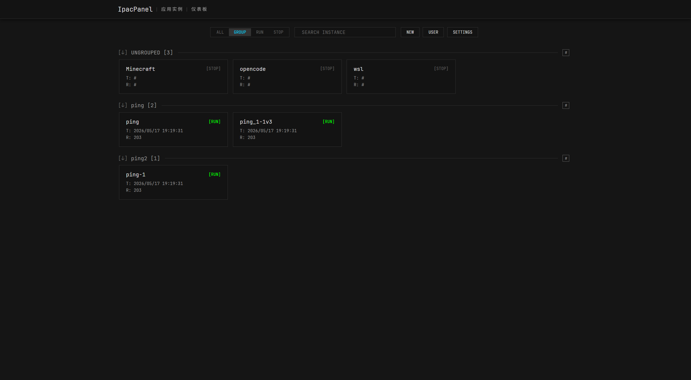
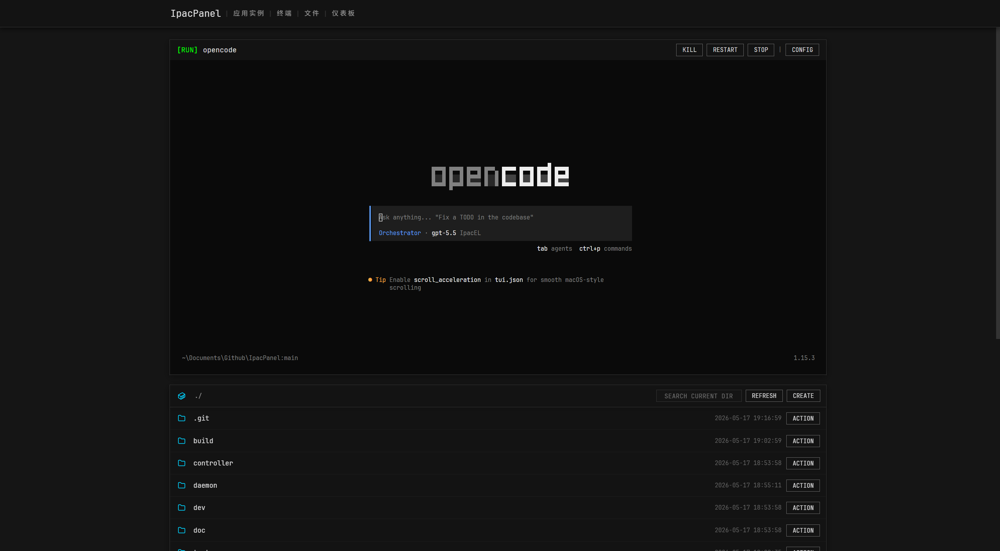
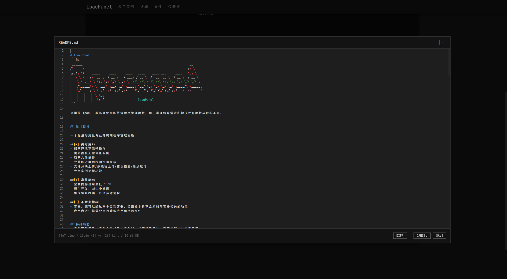
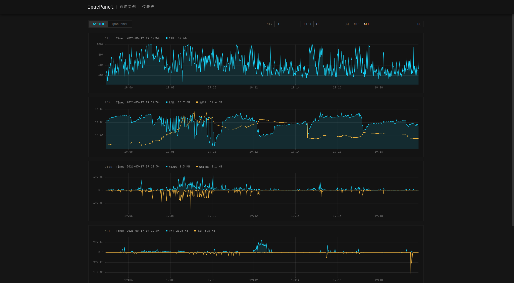

# IpacPanel
```js
 ______                                                            __     
/\__  _\                                                          /\ \    
\/_/\ \/    _____     ____     ____   ____    ____ ___     ____   \_\ \   
   \ \ \   /\  __ \  / __ \   / ___\ / __ \  /  __  __ \  / __ \  / __ \  
    \_\ \__\ \ \/\ \/\ \/\ \_/\ \__//\ \/\ \_/\ \/\ \/\ \/\ \/\ \/\ \/\ \ 
    /\_____\\ \  __/\ \__/ \_\ \____\ \__/ \_\ \_\ \_\ \_\ \____/\ \_____\
    \/_____/ \ \ \/  \/__/\/_/\/____/\/__/\/_/\/_/\/_/\/_/\/___/  \/____ /
              \ \_\                                                       
               \/_/                   IpacPanel                           
```

这里是 IpacEL 服务器使用的终端程序管理面板, 用于实现特殊需求和解决现有面板软件的不足.

> 交流和技术支持: `QQ: 185-979-632`


## 设计目标

一个轻量好用且专业的终端程序管理面板.

**[+] 高可用**
- 弱网环境下流畅操作
- 更新面板无需停止实例
- 原子文件操作
- 完善的进度跟踪和错误显示
- 文件分块上传/多线程上传/错误恢复/断点续传
- 专用实例更新功能

**[+] 高性能**
- 空载内存占用最低 15MB
- 原生开发, 减少中间层
- 集成仿真终端, 降低资源消耗

**[-] 不会支持**
- 容器: 您可以通过命令启动容器, 但面板本身不会添加与容器相关的功能
- 应用商店: 您需要自行管理应用程序的文件


## 特殊功能
- 实例更新目录: 实例启动或重启实例时, 将更新目录的内容覆盖到当前实例目录
- 文件夹上传: 文件上传支持同时选择一个文件夹或多个文件
- 不停机更新: 守护进程保持功能最小化以避免更新, 面板更新不影响实例运行
- 无终端模式: 如果实例不需要终端, 使用此模式为存在大量输出的实例节省资源
- 高级文本编辑器: 使用与 VSCode 相同的 Monaco 文本编辑器
- 严格重启: 仅在实例运行时进行计划任务重启
- 清理命令: 实例退出后运行清理命令
- 仪表板: 支持长期监控系统性能指标
- 访问链接: 支持自定义实例访问链接, 代替浏览器收藏夹和文本记录








## 最佳实践

**安全性**

目前此面板的安全性尚未得到充分测试和验证, 请谨慎将其开放到公网.
- 建议设置高安全系数密码
- 推荐使用 Tailscale 等异地组网工具连接

不推荐使用管理员权限运行面板, 如果需要, 请确保实例程序可信.

注意: 本项目大量使用 AI 工具进行开发.

**多用户**

此面板的多用户功能无法做到完全隔离, 您可能需要进行系统层面额外的权限设置.

**服务提供商**

面板本身的资源占用较低, 为保证安全性, 推荐为每个用户/主机安装单独的面板程序, 避免多个用户使用同一个面板.


## 细节

**运行实例**
- Windows: 通过 CreateProcess / ConPTY 运行实例, 默认不使用 shell, 仅在实例为 `.cmd` 或 `.bat` 脚本时, 使用 `cmd.exe` 作为脚本解释器
- Linux: 通过 fork + execve / PTY 运行实例, 默认不使用 shell

**启动优先级**

优先级数值越大的实例越早启动, 启动后不会等待实例启动完成, 而是按照设置的间隔时间继续启动其他实例.
- 优先级相同的实例按照实例名称升序排序启动
- 优先级支持使用负数

**实例更新**

面板会在实例启动时先检查更新目录, 如果存在文件则覆盖到实例目录, 同时备份覆盖目标作为备份, 覆盖失败时尽量进行回滚, 最后正常启动实例程序.
- 回滚发生错误不会影响实例继续启动, 启动失败不会进行回滚
- 更新功能会合并目录, 而非替换目录
- 仅备份实例目录与更新目录的文件交集, 默认不会备份完整实例

**终端**
- `Ctrl + C`: 在选中文本时默认复制选中文本, 未选中时会提示是否发送终止信号
- 可直接输入内容, 回车后发送到实例程序, 对于仿真终端模式支持键盘交互

**文件列表**
- 点击路径: 转到指定路径
- 点击文件图标: 多选文件/目录, 支持在多个目录中多选文件
- 点击文件列表图标: 全选当前显示的文件/目录, 支持搜索模式选择
- 点击对象: 编辑/预览, 对于不支持预览的文件则会打开操作卡片
- 右键未选择对象: 打开操作卡片
- 右键已选择对象: 打开批量操作卡片
- 搜索: 如果当前目录没有分页, 则前端搜索, 否则后端搜索; 不支持深度搜索
- 转到路径: 搜索框输入路径回车后自动跳转, 支持相对路径和绝对路径

**文件上传**

前端会自动处理文件上传的分片和错误恢复, 已完成的项目会自动从上传列表移除, 出现错误的项目会显示错误信息.

由于浏览器限制, 当前的文件夹上传功能只允许同时选择一个文件夹或多个文件, 文件夹和文件混合选择会导致无法读取文件夹.

**前端资源**

如果启动时存在 `./public` 目录, 则会优先读取该目录下的静态资源, 如果不存在则会回退到内置资源.

**免安装**

面板无需安装到系统程序目录, 运行时不会对系统目录造成污染.

**配置和存储**

```
.
├── data/					# 面板数据
│   ├── dashboard/			# 仪表板数据
│   ├── update/				# 管理进程更新目录
│   ├── auth.yml			# 用户和权限配置
│   ├── config.yml			# 面板配置
│   ├── instances.yml		# 实例配置
│   └── temp.yml			# 临时文件
│
└── instances/				# 默认实例文件目录
```

- `./data/auth.yml`
	- 对于每个 `pass` 字段, 支持输入明文密码进行修改, 管理进程启动后会自动将其转换为哈希值

- `./data/config.yml`
	- 面板通过实例名称来定位实例在内存中的数据, 对于所有面板提供的功能, 面板会正确处理重命名后的数据对齐
	- 无法保证运行过程中手动对实例配置修改再热重载后的数据正确性, 不推荐在实例运行时手动修改实例配置文件中的实例名称

- `./data/instances.yml`
	- 所有实例的配置都存储在此文件中, 面板会自动省略与默认值相同的配置项

- `./data/temp.yml`
	- 用于支持断电后的数据清理, 比如原子操作文件残留


**手动回滚/重启**

如果更新后发现面板前端无法访问, 那么面板支持通过不停机手动更新来解决问题.

1. [可选] 将新的管理进程可执行文件放置在 `./data/update/` 目录或手动修改配置文件
2. 强制结束 `IpacPanel_Controller` 进程
3. 守护进程会自动更新并重启管理进程


## 计划中

- [ ] 用户文档
- [ ] 数据库编辑器


## 已知问题

- Web 终端每次刷新页面后字符宽度可能不同


## 项目结构

```
.
├── build.go                 # 构建和打包脚本
├── go.mod / go.sum
│
├── controller/              # 管理进程
│   ├── main.go              # 管理进程入口
│   ├── src/
│   │   ├── config/          # 配置
│   │   ├── process/         # 实例管理
│   │   ├── web/             # Web 服务
│   │   │   └── api/         # Web API / WebSocket
│   │   ├── compat/          # 跨平台兼容工具
│   │   ├── atomicfile/      # 原子文件写入工具
│   │   └── msg/             # 消息定义
│   │
│   └── public/              # Web 前端静态资源
│       ├── index.html       # 前端入口
│       ├── lib/             # 前端第三方库
│       └── src/
│           ├── api/         # 前端 API 封装
│           ├── page/        # 页面代码
│           ├── module/      # 模块化代码: 终端/文件管理/弹窗/用户管理等
│           ├── platform/    #
│           └── utils/       # 工具/图标/枚举
│
├── daemon/                  # 守护进程
│   ├── main.go              # 守护进程入口
│   ├── server.go            # 守护进程服务主流程
│   ├── controller.go        # 管理进程管理
│   ├── instance.go          # 实例生命周期管理
│   ├── protocol.go          # stdio 通讯协议
│   ├── terminal/            # PTY/ConPTY 终端封装
│   └── compat/              # 跨平台兼容工具
│
├── dev/                     # 开发和测试工具
├── tester/                  # 自动化测试程序
└── doc/                     # 部分设计文档
    └── user_docs/           # 用户文档
```

由于项目初期有大量设计描述没有形成文档, 因此当前设计文档并不完善.


## 构建

```bash
git clone https://github.com/ApliNi/IpacPanel.git
cd IpacPanel
go run ./build.go
```

构建产物存放在 `./build` 目录.

其他构建参数请查看 `./build.go` 文件.


## 直接依赖

**前端**
- 原生前端
- 网页终端: [xterm.js](https://github.com/xtermjs/xterm.js)
- 文本编辑器: [Monaco-Editor](https://github.com/microsoft/monaco-editor)
- 图表库: [uPlot](https://github.com/leeoniya/uPlot)
- 中文等宽字体: [JetBrainsMapleMono-Medium](https://github.com/SpaceTimee/Fusion-JetBrainsMapleMono)
- 英文等宽字体: [JetBrainsMono-Regular](https://github.com/JetBrains/JetBrainsMono)
- 矢量图标: [Lucide](https://lucide.dev/icons/)
- 图像/图标: [IpacEL](https://ipacel.cc)

**管理进程**
- Golang, 及其标准库
- WebSocket: [`github.com/gorilla/websocket`](https://github.com/gorilla/websocket)
- 定时任务调度: [`github.com/reugn/go-quartz/quartz`](https://github.com/reugn/go-quartz)
- 系统指标采集: [`github.com/shirou/gopsutil/v4/`]( https://github.com/shirou/gopsutil)
- SQLite 数据库: [`modernc.org/sqlite`]( https://pkg.go.dev/modernc.org/sqlite)
- 文件解压: [`github.com/mholt/archives`](https://github.com/mholt/archives)
- 压缩算法: [`github.com/klauspost/compress`](https://github.com/klauspost/compress)

**守护进程**
- Golang, 及其标准库
- Unix 终端: [`github.com/creack/pty`](https://github.com/creack/pty)
- Windows 终端: [`github.com/UserExistsError/conpty`](https://github.com/UserExistsError/conpty)
- Shell 命令解析: [`github.com/kballard/go-shellquote`](https://github.com/kballard/go-shellquote)

**参考项目**
- 一个游戏服务器管理面板: [MCSManager](https://github.com/MCSManager/MCSManager)


## 错误报告

通常您可以直接通过 Issues 报告错误, 但如果发现严重漏洞, 请通过邮件与我联系: `aplini@ipacel.cc`.


---


